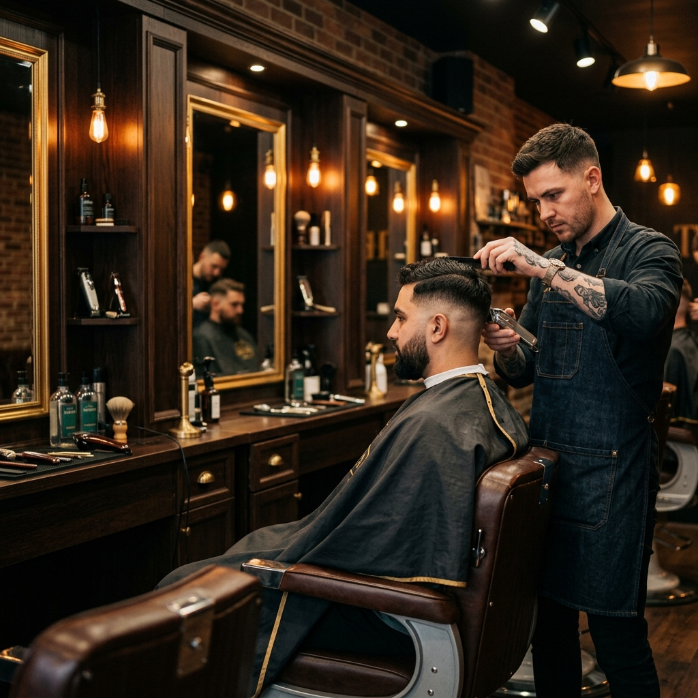

# ✂️ Barbearia Premium — Landing Page

Landing page one-page para barbearias e salões de barbeiro, com design dark/gold voltado ao público masculino premium. Projeto desenvolvido como peça de portfólio para prospecção de clientes freelance, com foco em performance, SEO técnico e conversão via WhatsApp.

🔗 **[Ver demo ao vivo](https://mhsilvadev.github.io/landing-page-barbearia/)** <!-- Substitua pelo link do deploy (Netlify/Vercel/GitHub Pages) -->



---

## 🚀 Tecnologias utilizadas


---

## 📌 Sobre o projeto

Este é um projeto **genérico/template**, desenvolvido para demonstrar capacidade técnica em landing pages de conversão para pequenos negócios locais (barbearias, salões, estúdios de estética). Todos os dados (endereço, telefone, avaliações) são fictícios e servem apenas para fins de demonstração — em um projeto real, essas informações são substituídas pelas informações reais do cliente.

### ✨ Principais features

- 🎨 **Design dark premium** com paleta preto + dourado, tipografia serifada (Playfair Display) para identidade visual sofisticada
- 📱 **Totalmente responsivo** — breakpoints para desktop, tablet e mobile
- ⚡ **Performance otimizada** — imagens em WebP com fallback PNG via `<picture>`, `loading="lazy"` e `fetchpriority="high"` na imagem principal
- 🔍 **SEO técnico completo**:
  - `robots.txt` e `sitemap.xml`
  - Meta tags (title, description, keywords, canonical)
  - Open Graph e Twitter Card para preview em redes sociais
  - Dados estruturados (Schema.org / JSON-LD) tipo `BarberShop`
- ♿ **Acessibilidade** — uso de `aria-label`, `aria-expanded`, `role`, hierarquia correta de headings e `alt` descritivo em todas as imagens
- 🎬 **Animações on-scroll** via `IntersectionObserver` (sem bibliotecas externas)
- 💬 **Botão flutuante de WhatsApp** com mensagem pré-formatada
- 🖱️ **Menu mobile** com toggle de hambúrguer
- 📊 Seções completas: Hero, Sobre, Serviços, Galeria, Equipe, Depoimentos, Tabela de Preços, CTA e Localização

---

## 📁 Estrutura do projeto

```
barbearia_premium/
├── assets/
│   └── images/          # Imagens em .png (fallback) e .webp (otimizadas)
├── index.html            # Estrutura principal + SEO + Schema.org
├── styles.css             # Estilos, variáveis CSS e responsividade
├── script.js               # Interações, scroll reveal, menu mobile
├── robots.txt             # Diretivas para crawlers
├── sitemap.xml             # Mapa do site para indexação
└── README.md
```

---

## 🛠️ Como rodar localmente

```bash
# Clone o repositório
git clone https://github.com/MHSilvaDev/barbearia-premium.git

# Entre na pasta
cd barbearia-premium

# Abra o index.html no navegador
# ou use uma extensão como Live Server (VS Code)
```

Não há dependências ou build steps — é um projeto 100% HTML/CSS/JS puro (vanilla), sem frameworks ou bibliotecas externas.

---

## 🎯 Sobre este template

Este projeto faz parte de um portfólio de landing pages desenvolvidas para pequenos negócios locais (barbearias, clínicas, personal trainers, salões, escritórios). Se você tem um negócio e busca um site rápido, otimizado para Google e pronto para converter visitantes em clientes via WhatsApp, entre em contato.

---

## 📬 Contato

[](https://github.com/MHSilvaDev)
[](https://www.linkedin.com/in/mhsilvadev/)
[](https://wa.me/5534999147815)
[](mailto:marciohenriquesilva@gmail.com)

---

<p align="center">Desenvolvido por <strong>Marcio Henrique Silva</strong></p>
