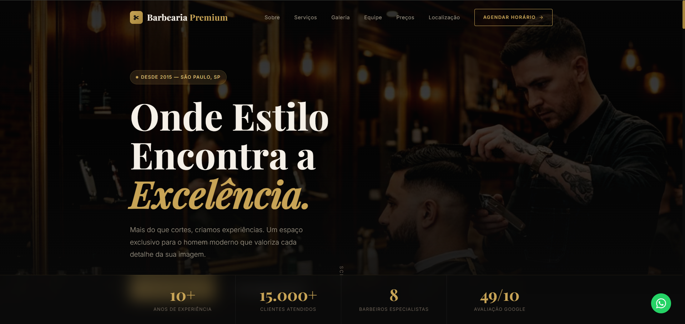

<div align="center">

# ✂️ Barbearia Premium — Landing Page

**Landing page one-page para barbearias e salões, com design dark/gold voltado ao público masculino premium — SEO técnico completo e conversão via WhatsApp.**


[🔗 Ver Demo](https://mhsilvadev.github.io/landing-page-barbearia) · [📋 Funcionalidades](#-funcionalidades) · [🚀 Como usar](#-como-usar)

<br>



</div>

---

## 📖 Sobre o Projeto

Landing page desenvolvida para uma **barbearia fictícia (Barbearia Premium)**, projetada para captar clientes e agendar horários via WhatsApp. O foco foi criar uma identidade visual masculina e sofisticada — paleta preto + dourado com tipografia serifada — comunicando exclusividade antes mesmo do visitante ler uma palavra.

> 🧑‍💻 **100% vanilla** — HTML, CSS e JavaScript puros. Zero dependências, zero frameworks.

---

## ✨ Funcionalidades

| Funcionalidade                     | Descrição                                                                                                                         |
| :--------------------------------- | :-------------------------------------------------------------------------------------------------------------------------------- |
| 🎨 **Design dark premium**         | Paleta preto + dourado, tipografia serifada (Playfair Display) para identidade visual sofisticada                                 |
| 📱 **Totalmente responsivo**       | Breakpoints para desktop, tablet e mobile                                                                                         |
| 🖼️ **Imagens otimizadas em WebP**  | Todas as imagens usam `<picture>` com `.webp` (moderno) e `.png` como fallback, `loading="lazy"` e `fetchpriority="high"` na hero |
| 🎬 **Scroll reveal**               | Animações de entrada via `IntersectionObserver`, sem bibliotecas externas                                                         |
| 💬 **Botão flutuante de WhatsApp** | Contato rápido com mensagem pré-formatada                                                                                         |
| 🍔 **Menu mobile**                 | Toggle de hambúrguer, com fechamento acessível                                                                                    |
| 🔍 **SEO otimizado**               | Meta tags, Open Graph, Twitter Cards, Schema.org (`BarberShop`), sitemap.xml e robots.txt                                         |
| ♿ **Acessibilidade**              | `aria-label`, `aria-expanded`, `role`, hierarquia de headings correta e `alt` descritivo em todas as imagens                      |
| 📊 **Seções completas**            | Hero, Sobre, Serviços, Galeria, Equipe, Depoimentos, Tabela de Preços, CTA e Localização                                          |

---

## 🛠️ Tecnologias

<table>
  <tr>
    <td align="center" width="120">
      
      <br><strong>HTML5</strong>
      <br><sub>Semântico</sub>
    </td>
    <td align="center" width="120">
      
      <br><strong>CSS3</strong>
      <br><sub>Custom Properties</sub>
    </td>
    <td align="center" width="120">
      
      <br><strong>JavaScript</strong>
      <br><sub>ES6+ vanilla</sub>
    </td>
  </tr>
</table>

### Destaques técnicos

- **`<picture>` + WebP** — imagens até 90% mais leves que os PNGs originais, com fallback automático para navegadores sem suporte
- **IntersectionObserver** — scroll reveal nativo, sem bibliotecas externas
- **Schema.org JSON-LD** — dados estruturados tipo `BarberShop` para SEO local
- **CSS Custom Properties** — paleta de cores e tipografia tokenizadas

---

## 📁 Estrutura do Projeto

```
landing-page-barbearia/
├── assets/
│   └── images/            # Imagens em .webp (otimizadas) + .png (fallback)
├── index.html               # Estrutura principal + SEO + Schema.org
├── styles.css                # Estilos, variáveis CSS e responsividade
├── script.js                  # Interações, scroll reveal, menu mobile
├── robots.txt                 # Diretivas para crawlers
├── sitemap.xml                 # Mapa do site para indexação
└── README.md
```

---

## 🚀 Como Usar

### Pré-requisitos

Nenhum! O projeto é 100% estático — basta um navegador moderno.

### Rodando localmente

```bash
# Clone o repositório
git clone https://github.com/MHSilvaDev/landing-page-barbearia.git

# Entre na pasta
cd landing-page-barbearia

# Abra com Live Server (VS Code) ou sirva com qualquer servidor estático
npx serve .
```

Não há dependências ou build steps — é um projeto 100% HTML/CSS/JS puro (vanilla).

### Deploy

O projeto está pronto para deploy em qualquer plataforma de hospedagem estática:

| Plataforma       | Comando / Ação                            |
| :--------------- | :---------------------------------------- |
| **GitHub Pages** | Ative nas Settings → Pages → Branch: main |
| **Netlify**      | Drag & drop da pasta no dashboard         |
| **Vercel**       | `vercel --prod`                           |

---

## ⚠️ Aviso

Este é um **projeto de demonstração/portfólio**, com dados fictícios (endereço, telefone, avaliações). Ao usar como base para um cliente real, é necessário substituir todas as informações de contato, imagens e o `aggregateRating` do Schema.org por dados reais — evitando conteúdo estruturado com avaliações falsas, que viola as diretrizes do Google.

---

## 📄 Licença

Este projeto está sob a licença **MIT**. Veja o arquivo [LICENSE](LICENSE) para mais detalhes.

---

## 👤 Autor

<div align="center">

**Márcio Henrique Silva**

Desenvolvedor Front-End

[](https://github.com/MHSilvaDev)
[](https://www.linkedin.com/in/mhsilvadev/)
[](https://wa.me/5534999147815)
[](mailto:marciohenriquesilva@gmail.com)

</div>

---

<div align="center">

Feito com ☕ e ✂️ por [MHSilvaDev](https://github.com/MHSilvaDev)

</div>
